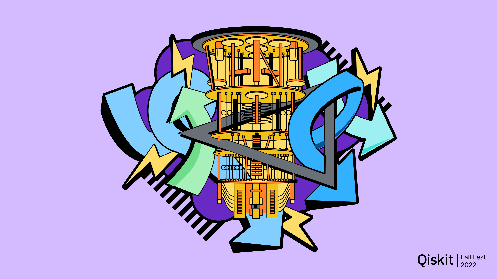
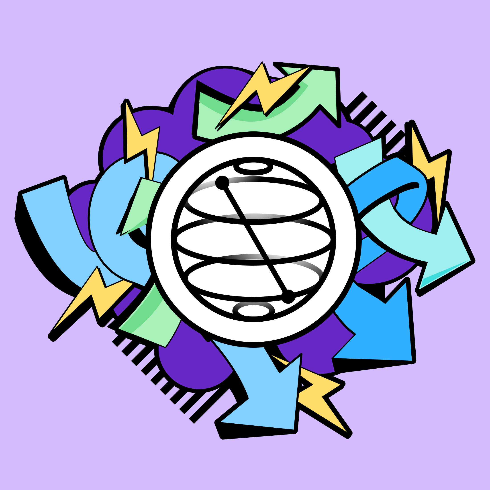

# CWRU Qiskit Fall Fest 2022

##  Welcome
We are super excited to have our first [Qiskit Fall Fest](https://qiskit.org/events/fall-fest/) event here at Case Western Reserve University (CWRU)! The [Qiskit Fall Fest](https://medium.com/qiskit/introducing-the-qiskit-fall-fest-feb8456b557) is a collection of quantum computing events on college campuses around the world, with the goal of helping to grow the local community’s skill sets in quantum computing. This event is being hosted by the Case Quantum Computing (CQC) Club and supported by IBM Quantum. Please consider joining our club (signup form [here](https://docs.google.com/forms/d/e/1FAIpQLSd1y1zYMXbG8hL9eRnmuG1AYNJ4lgl1B1Lgwy0XtY09aT_8EQ/viewform)) and participating in this event! 

The Fall Fest @ CWRU is going to be a two-week event. The first week (Oct. 10 - 14) will be a series of workshops on quantum computing and [Qiskit](https://qiskit.org/), and the second week (Oct. 15 - 21) will be a hackathon challenge, with **prizes sponsored by IBM Quantum**. Details about the hackathon and rules can be found below. The deadline for all projects is Oct. 24th, at 12 pm ET. Any projects submitted after that will NOT be judged. Good luck!

--------------------------------
##   Official Registration
- You may choose to participate in the workshops or the hackathon, or both! Before signing up for the hackathon, please read the event details below.
- This is a hackathon for members of CWRU only.
- To officially sign up, register using [this link](https://docs.google.com/forms/d/1J1wS6Z5Vp1Ptguil-dmrk4_oTPiZ9v0ZLp_cImEr32c/prefill).

##   Hackathon Details
- All projects submitted must follow the hackathon prompt, which will be revealed on Saturday, Oct. 15, 9 am ET.
- All projects are due on Oct. 24, 12 pm ET. There will be an optional project presentation shortly after the deadline (time and details TBA).
- All projects must use Qiskit, the open-source SDK for working with quantum computers at the level of pulses, circuits, and application modules. You can learn more about Qiskit and begin getting familiar [here](https://qiskit.org/learn/). We will also provide dedicated lectures/tutorials during the workshops to help you get started with basic and more advanced features of Qiskit.
- We are accepting entries either individually or in teams up to 5. If you don't have a team yet, feel free to post on our [Discord](https://discord.gg/tMWdvP9y) channel to find teammates!
- When submitting your project, You and your team should [open an issue on this page](https://github.com/Case-Quantum-Computing-Club/CQC-qiskit-fall-fest-22/issues) which contains info about who you are, what your project is, and most importantly a link to your GitHub page where you will be building or maintaining the code for your project.

--------------------------------
##  Schedule

We are proud to welcome you to the CQC Qiskit Fall Fest. Our team of organizers has put together an amazing schedule of events, learning, guest speakers, and more for you. See the schedule below.

| Date | Event |
| --- | --- |
| Mon, Oct 10 | Intro to Quantum Computing (Caden Kacmarynski)   Intro to Linear Algebra for QC (Prof. Shuai Xu) |
| Tue, Oct 11 | Intro to Qiskit (Adrian Harkness)   Intro to Quantum Mechanics (Prof. Jesse Berezovsky) |
| Wed, Oct 12 | Application - Qiskit Nature (Dr. Das Pemmaraju) |
| Thu, Oct 13 | Application - Qiskit Finance (Grishma Prasad) |
| Fri, Oct 14 | Application - Qiskit Machine Learning (Ruihao Li) |
| Sat, Oct 15 | Teams Formed and Hackathon Begins |
| Fri, Oct 21 | Submissions Due and Project Presentations |
| Mon, Oct 24 | Winners Announced |

Connect with mentors and fellow attendees on Discord: https://discord.gg/tMWdvP9y

Join the Qiskit Slack workspace: https://ibm.co/joinqiskitslack

--------------------------------
## [Qiskit Events Code of Conduct](https://github.com/Qiskit/qiskit/blob/master/CODE_OF_CONDUCT.md)
